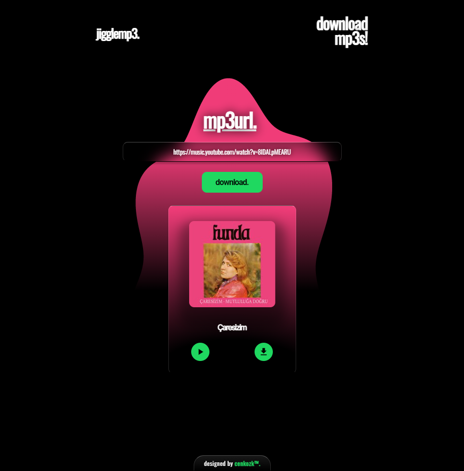

# React MP3 Downlader

## Disclaimer

Copyright Disclaimer under Section 107 of the copyright act 1976, allowance is made for fair use for purposes such as criticism, comment, news reporting, scholarship, and
research. Fair use is a use permitted by copyright statute that might otherwise be infringing. Non-profit, educational or personal use tips the balance in favour of fair
use.

This app not intended to be use for any purpose, it's just a study project.
**Use it on your own responsibility.**

[Link to the site](https://jigglemp3.vercel.app)  
[Link to the figma design](https://www.figma.com/file/iyaDTQzbwasgfxkBjTPU8s/Jiggle-MP3-Downloader?node-id=0%3A1&t=fZRmYZR21i7Dihee-0)

> Web version is down below.
>
> 

## The work done down below.

-UI Work. ✅  
-Scraping the mp3 data from a third party service (without any api). ✅  
-UI Design. ✅  
-Creating the accent color from video or music cover (it extracts 2 colors and compares the luminances to avoid black accent color). ✅  
-Animations with Framer framwork. ✅  
...
